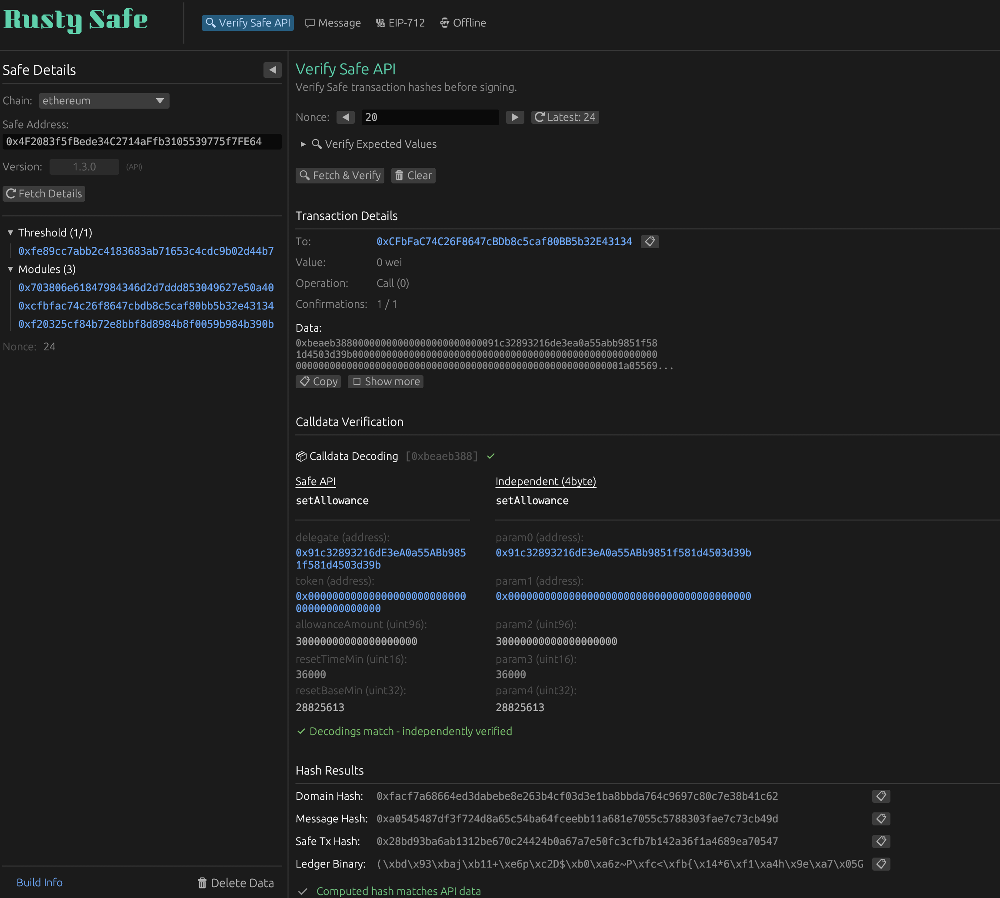

# [RustySafe](https://rustysafe.com)

**Independent transaction verification for Safe (Gnosis Safe) multisig wallets.**

Built in Rust. No JavaScript. No npm. Verify what you sign.



---

## How to Verify a Transaction

1. Go to [rustysafe.com](https://rustysafe.com) (or your self-hosted instance)
2. Select the **chain** (e.g., Ethereum Mainnet)
3. Enter your **Safe address** (e.g., `0x1c694Fc3006D81ff4a56F97E1b99529066a23725`)
4. Enter the **nonce** of the pending transaction
5. Click **Fetch Details** and then **Verify**
6. Compare the **Safe Transaction Hash** displayed with what your hardware wallet shows
7. Review the **decoded calldata** to confirm the transaction does what you expect

If the hashes match and the calldata is correct, the transaction is what it claims to be.

---

## Quick Start

**Hosted Version:**  
[https://rustysafe.com](https://rustysafe.com)

> **Note:** The hosted version introduces trust in the deployment. For maximum security, build from source and run locally.

**Self-Host (Docker):**
```bash
docker build -f Dockerfile.local -t rustysafe .
docker run -p 8080:80 rustysafe
# Open http://localhost:8080
```

**Build Locally:**
```bash
cd crates/rusty-safe
trunk serve --release
```

----

## Features

- **Transaction Hash Computation** — EIP-712 typed data hashing per Safe specification
- **Decoded Calldata** — Human-readable display of token transfers, owner changes, and contract interactions
- **Security Warnings** — Alerts for delegate calls, non-standard gas tokens, nonce mismatches, and dangerous operations
- **Multi-Chain Support** — Ethereum, Arbitrum, Base, Polygon, Optimism, and more

---

## The Problem

Multisig wallets are high-value targets. Attacks have exploited the gap between what signers see on screen and what they actually sign.

When approving a Safe transaction, hardware wallets display a hash—not human-readable transaction details. You're trusting that the interface showing you "Transfer 100 USDC to Treasury" is actually requesting a signature for that exact transaction.

**The current Safe tooling landscape is built primarily on JavaScript and npm.** This is a structural reality, not a criticism of any specific implementation. Supply chain attacks against npm packages occur regularly. A compromised dependency anywhere in the chain can manipulate what you sign.

Even transaction simulation has limits. There's no guarantee the data sent to a simulation service matches what's sent to your hardware wallet for signing. A compromised interface could display legitimate simulation results while requesting a signature on a different transaction.

---

## The Solution

RustySafe provides an independent verification layer built outside the JavaScript ecosystem.

- **Fetch transactions** from Safe Transaction Service
- **Compute the EIP-712 hash** locally in your browser
- **Verify it matches** what your hardware wallet displays
- **Review decoded calldata** to understand exactly what you're signing

No npm dependencies. No JavaScript in the critical path. The entire verification happens in Rust compiled to WebAssembly.

---

## Trust Assumptions

Even with RustySafe, you are trusting:

| Trust | Notes |
|-------|-------|
| **This codebase** | Review the source, or build from source yourself |
| **Safe Wallet contracts** | The underlying Safe smart contracts |
| **Your operating system** | Your device and browser |
| **Safe Transaction Service API** | Unless you use manual/offline input mode |
| **4byte.directory / Sourcify** | Used for calldata decoding (function signatures) |
| **The hosted version** | If using rustysafe.com, you're trusting the deployment. [Verify it →](VERIFY.md) |

To minimize trust, use manual input mode and build from source.

---

## Recommended Workflow

1. **Construct** transactions using Safe UI or any interface you prefer
2. **Verify** the transaction hash with RustySafe
3. **Confirm** the hash matches what your hardware wallet displays
4. **Sign** once verification is complete

This model keeps the user experience of existing interfaces for transaction construction while adding an independent verification layer with a smaller attack surface.

---

## Key Properties

| Property | What It Means |
|----------|---------------|
| **No npm dependencies** | Built entirely in Rust, compiled to WebAssembly. Sidesteps the JavaScript supply chain. |
| **Reproducible builds** | Docker-based builds with GitHub attestation. You can verify the app itself. |
| **Offline capable** | Manual input mode works without Safe Transaction Service API. |
| **Open source** | Inspect every line of code. No hidden dependencies. |

---

## Security Practices

1. **Use a separate device** for verification, different from where you construct or sign transactions. This adds resilience if your main device is compromised.

2. **Manually verify what you expect, then compare to what you get.** This tool shows you what the transaction contains—you must confirm it matches your intent.

3. **Understand the parameters you're signing.** This tool is only useful if you can read the output. Learn to interpret calldata and transaction fields.

4. **Use offline mode when possible.** Manual input eliminates dependency on Safe Transaction Service API.

---

## Verify the App Itself

Don't trust me—verify.

RustySafe supports reproducible builds with GitHub attestation. You can:

1. Check the deployed build info at [rustysafe.com/BUILD_INFO.txt](https://rustysafe.com/BUILD_INFO.txt)
2. Rebuild from source and compare hashes
3. Verify GitHub's cryptographic attestation

**[Full verification instructions →](VERIFY.md)**

---

## Supported Chains

All chains supported by Safe Transaction Service:

- Ethereum Mainnet
- Arbitrum One
- Base
- Optimism
- Polygon
- Gnosis Chain
- Avalanche
- BNB Chain
- And more...

---

**Educational Resources:**
- [Verifying Safe Wallet transactions](https://updraft.cyfrin.io/courses/advanced-web3-wallet-security/signer-advanced/verify-multi-sig-signatures) (Cyfrin Updraft)
- [How to perform basic transaction checks](https://help.safe.global/en/articles/276343-how-to-perform-basic-transactions-checks-on-safe-wallet) (Safe Help)
- [How to verify a Safe TX on a hardware wallet](https://help.safe.global/en/articles/276344-how-to-verify-safe-wallet-transactions-on-a-hardware-wallet) (Safe Help)

---

## Development

**Prerequisites:**
- Rust 1.83+
- trunk (`cargo install trunk`)

**Run locally:**
```bash
cd crates/rusty-safe
trunk serve
```

**Build for production:**
```bash
trunk build --release
```

**Tech Stack:**
- [Rust](https://www.rust-lang.org/) — Systems programming language
- [egui](https://github.com/emilk/egui) — Immediate mode GUI framework
- [alloy-rs](https://github.com/alloy-rs/alloy) — Ethereum primitives
- [safe-utils](https://github.com/Cyfrin/safe-hash-rs) — Safe hash computation

---

## Acknowledgements

- [safe-hash-rs](https://github.com/Cyfrin/safe-hash-rs) — Rust CLI tool for Safe transaction hash verification
- [safe-tx-hashes-util](https://github.com/pcaversaccio/safe-tx-hashes-util) — Shell CLI tool for Safe transaction hash verification
- [4byte.directory](https://www.4byte.directory/) — Function signature database for calldata decoding
- [Sourcify](https://sourcify.dev/) — Smart contract verification and ABI lookup

---

## Contributing

Contributions welcome. Please open an issue to discuss significant changes before submitting a PR.

---

<p align="center">
  <em>Verify what you sign.</em>
</p>
